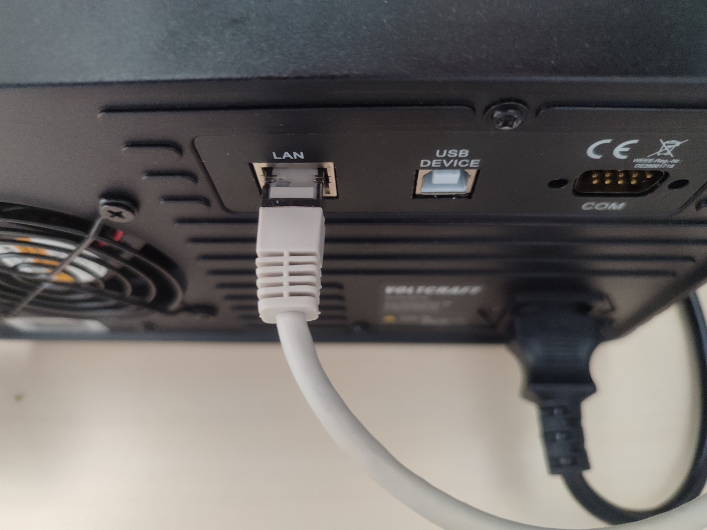
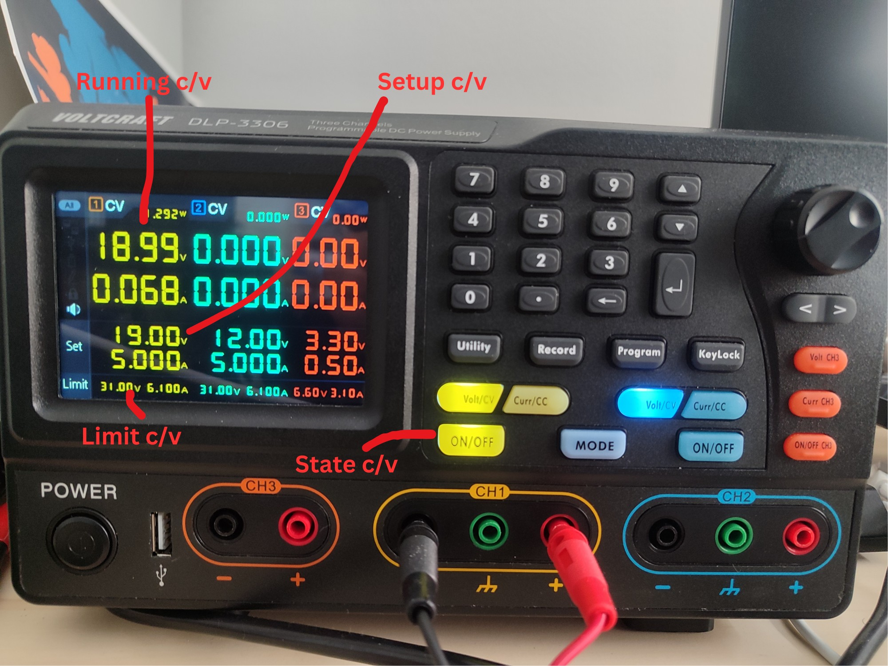

# Python package for Voltcraft DLP 3306 powersupply

**voltcraft_dlp3306** is a Python package to interact with Volcrat powersupply with respect [to its SCPI protocol implementation](https://asset.conrad.com/media10/add/160267/c1/-/en/002619140ML00/mode-demploi-2619140-alimentation-de-laboratoire-reglable-voltcraft-dlp-3306-0-30-v-0-6-a-378-w-rs-232-usb-lan-fonction-esclave-nbr-d.pdf)

## Installation

We encourage installing this package via the pip tool (a Python package manager):

```bash
pip install voltcraft-dlp3306
```

Physically plug an RJ45 cable to the Volcraft device and a switch or directly to your laptop.



The IP address and the port of your Voltcraft device can be found/setup at: 'Utility' button > 'Port set' tab > 'LAN set' subtab

## Getting started

This plugin is designed to be *straightforward and stateless*. Some improvements/optimizations could be done with a stateful object.

```python
import asyncio
from voltcraft_dlp3306 import VoltcraftDLP3306

async def main_async():
    # Device ip and port can be found directly on the powersupply option
    vtc = await VoltcraftDLP3306.create_device(ip="12.12.12.12", port="1234")

    # Set current (Ampere) at channel 1
    await vtc.set_setup_current_chan(4, 1)

    # Set voltage (Volt) at channel 1
    await vtc.set_setup_voltage_chan(15, 1)

    # Turn on channel 1
    await vlt.turn_on_chan(1)

    # Print current (Ampere) at channel 1
    print(await vlt.get_running_current_chan(1))

    # Record channels values (voltage and current) to a csv file
    # You can provide a callback to stop the record at anytime
    await vlt.watch(frequency=0.2, out="measure.csv", channels=[1,2,3])

    # Turn off channel 1
    await vlt.turn_off_chan(1)

if __name__ == "__main__":
    asyncio.run(main_async)

```

Vocabulary explained:



## Development
This repository is at its early stage and is still in active development. If you are looking for a way to contribute please read [CONTRIBUTING.md](CONTRIBUTING.md).

## Reach us
We love feedback. Feel free to reach us on [Scaleway Slack community](https://slack.scaleway.com/), we are waiting for you on [#opensource](https://scaleway-community.slack.com/app_redirect?channel=opensource)..

## Licence
[License Apache 2.0](LICENCE)
